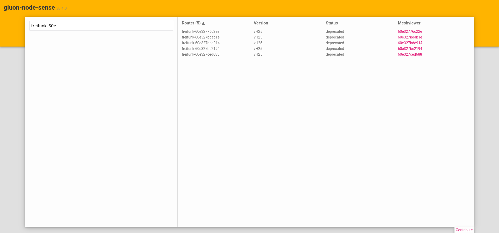

# gluon-node-sense

## usage

```console
Usage: gluon-node-sense <COMMAND>

Commands:
  server
  show-deprecated          Show deprecated models as json
  show-deprecated-devices
  help                     Print this message or the help of the given subcommand(s)

Options:
  -h, --help     Print help
  -V, --version  Print version
```

## configuration

The server can be configured using environment variables like these:

```bash
export BIND_HOST="0.0.0.0"
export BIND_PORT=8080
export NODES_JSON_URL="https://harvester.ffh.zone/api/nodes.json"
export NODES_JSON_POLL_INTERVAL_S=60
```

## deployment

An exemplary deployment looks like this:



and a running instance can most likely be found at https://gluon-node-sense.ffh.zone.
It's last update can be evaluate in the GitHub repo under "deployments".
